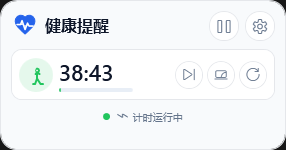

# WinDeskReminder

WinDeskReminder is a lightweight Windows desktop health reminder widget built with WPF. It docks to a screen edge, hides into a compact handle, and reminds you to stand, drink water, rest your eyes, or follow your own custom reminder schedule.



## Features

- Edge-docked floating widget with hover-to-expand behavior.
- Tray icon with show/hide, pause/resume, sound toggle, focus mode, settings, and exit commands.
- Multiple reminders with independent countdowns.
- Card-style reminder editor with custom add/delete support in Settings.
- Reminder confirmation flow: when a countdown reaches zero, confirm the reminder to start the action countdown, then automatically return to the work countdown.
- Native Windows toast notifications with quick actions for start, snooze, and skip.
- Daily completion stats in the tray menu.
- Optional start with Windows.
- Per-reminder sound toggles and selectable reminder icons.
- Configurable quiet hours that pause timers during do-not-disturb periods.
- Focus mode presets for 25, 50, and 90 minutes.
- Timer pause while the session is locked, the system is suspended, focus mode is active, or the user has been idle for the configured duration.
- Select target display and dock edge.
- Drag the widget header to snap it to a nearby screen edge.
- Dynamic widget height based on the number of reminder items.
- Persistent settings stored at `%APPDATA%\WinDeskReminder\settings.json`.

## Requirements

- Windows 10/11 x64.
- .NET SDK 10.0 or later for development.

The published `win-x64` build is self-contained, so target machines do not need to install the .NET runtime.

## Run From Source

```powershell
dotnet run
```

## Build

```powershell
dotnet build .\WinDeskReminder.csproj -c Release
```

## Create Portable EXE

The repository includes a PowerShell script that publishes a self-contained single-file executable.

```powershell
.\scripts\Build-Portable.ps1
```

Output:

```text
artifacts\publish\win-x64-1.0.0-single\WinDeskReminder.exe
```

To build another version:

```powershell
.\scripts\Build-Portable.ps1 -Version 1.0.1
```

## Digital Signing

The generated EXE is not signed by default. For public distribution, sign it with a trusted code-signing certificate and timestamp server.

Example:

```powershell
signtool sign /fd SHA256 /tr http://timestamp.digicert.com /td SHA256 /f .\codesign.pfx /p <password> .\artifacts\publish\win-x64-1.0.0-single\WinDeskReminder.exe
```

## Project Structure

```text
Controls/                 Custom WPF controls
Models/                   Reminder and dock models
Services/                 Settings, tray icon, system activity, reminder controller
scripts/Build-Portable.ps1
App.xaml / MainWindow.xaml / SettingsWindow.xaml
```

## Notes

- Build outputs and debug symbols are intentionally excluded from Git.
- Settings and error logs are written under `%APPDATA%\WinDeskReminder`.
- Daily stats are written to `%APPDATA%\WinDeskReminder\stats.json`.
